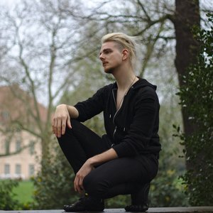

	<h1>{{ page.title }}</h1>
	<h2>Moderation und Beratung</h2>
	<h3>Fragen. Zuhören. Denken. Lernen. Verstehen.</h3>

	

Zweifeln ist gut. Zweifeln ist der Motor der Aufklärung. Ohne Zweifel gibt es keinen Fortschritt. Wer die Wege des Lebens nicht austestet, wird keine neuen Wege entdecken. Wer nicht hinterfragt, kann die Welt nicht erkennen.  
Ehrliches Zweifeln ist Ausdruck von Neugier und Interesse.

<blockquote>"Wie kommt der Pups jetzt aus dem Zelt?"</blockquote>
fragte ich meine Tante nach dem Pupsen im geschlossenen Zelt als ich 5 war.

Das Fragenstellen, Zuhören, Lernen und Verstehen ist geblieben. Zweifeln.org wurde mein Blog. Mein Ort zum Nachdenken und Zweifeln. Zum Fragen stellen, beantworten und ausprobieren.

In verschiedenen Branchen hatte ich sehr unterschiedliche Jobs und glaube, dass es den einen *richtigen* Job nicht für mich gibt - sondern ich immer wieder an mir, meinen Jobs und meinem Leben zweifel. Und ich glaube, darin liegt eine Chance, denn Zweifeln führt zu Verständnis. Nur wer die Welt versteht, kann sie nachhaltig verändern.

Es ist die Kunst des Zweifelns, immer wieder zu hinterfragen und dabei nicht in den Zweifeln stecken zu bleiben, sondern die Fragen auch zu beantworten und dabei Verständnis und Fortschritt zu produzieren. Zu lernen.

Die Kunst des Zweifelns, des strukturierten Nachdenkens, biete ich hier an. In zwei Varianten: Moderation und Beratun

<h3>
Moderation
</h3>

Ich stelle Fragen und sorge für gehaltvolle, sinnstiftende und faire Gespräche mit möglichst viel Verständnis.
Das gilt für:

<h4>Arbeitsbesprechungen</h4>

Immer wieder erzeugen Besprechungen Konflikte, weil die Gesprächsleitung nicht gut ist. Zum Thema reden, sich kurz fassen, einander ausreden lassen, alles wichtige ansprechen, aber nicht verzetteln. Arbeitsbeprechungen gibt es häufig und doch laufen sie selten gut.

<h4>Versammlungen</h4>

Mitgliedsversammlung, Eigentümer\*innenversammlung, Betriebsversammlung.  
Versammlungen brauchen nicht nur eine inhaltlich gute Strukturierung, damit sie zügig und erfolgreich abgehalten werden, sondern müssen auch formalen Ansprüchen genügen, damit Beschlüsse rechtswirksam sind.

<h4>Öffentliche Veranstaltungen</h4>

Podiumsdiskussionen, Fachgespräche, politische Debatten.  
Gute Gespräche brauchen spannende Menschen, die Interessantes erzählen. Und sie brauchen gute Fragen, damit diese spannende Menschen auch erzählen, was interessant - und für das jeweilige Publikum - verständlich ist.

<h3>
Beratung
</h3>

Ich bin Generalist und Rätsellöser. In mir kommt Wissen aus sehr unterschiedlichen Bereichen zusammen und entsprechend betrachte ich ein Problem aus vielen Perspektiven und finde oft aus anderen Perspektiven auch andere Lösungen.

Genau so sehe ich in vielen "Lösungen" Probleme, die erst mit etwas Zeitverzug für manch andere offenkundig werden. Ich kann davor bewahren, Fehler zu machen, weil ich die Probleme nicht nur sehe, sondern sie auch verständlich erklären kann, sodass Fehlinvestitionen oft vermieden werden können.

Gerne coache ich auch, wie Besprechungen oder Versammlungen gut funktionieren. Besprechungen und Versammlungen effektiv halten ist essenziell für eine erfolgreiche Organisationen.

	<b>Pick my brain!</b> 
	<a href="mailto:gero@zweifeln.org">gero@zweifeln.org</a>

Preise richten sich an den Umfang und Aufwand der jeweiligen Anfrage - als Richtwert arbeite ich für 75€/Stunde.

<!--

Wer bin ich und was für Erfahrungen bringe ich mit?

Studium: Philosophie, Kognitionswissenschaft, Mathematik, Informatik, Chemie, Kulturwissenschaften in Freiburg/Breisgau, Berlin (HU und TU), Hagen (Fernuni) und Valencia (Spanien).
Arbeitserfahrungen: KI-Startup (Tognos, KI Bundesverband), Sexarbeit, Netz- und Digitalpolitik: AlgorithmWatch, D64, CCC, DigitalCourage, IGF-D, Cyborgs e.V., Selbstständiger Webentwicklung, Schauspiel im c-atre, Konferenz-Organisation, Landesvorstand der Berliner Piratenpartei, Praktikum bei B90/Grüne, Demo-Organisation, Fahrradkurier, Straßen- und Türwerbung, Kellner.
Aufgewachsen auf einen Bauernhof in Sachsen-Anhalt. 

(Links, soweit vorhanden?)

Und sonst: ADHD, Depressionen, Anxieties, Therapie. Queer. Fotografiert manchmal gerne Menschen und treibt viel Sport.

Lernt gerne Sprachen: Deutsch, Englisch, Französisch, Spanisch, Mandarin (Chinesisch).
-->